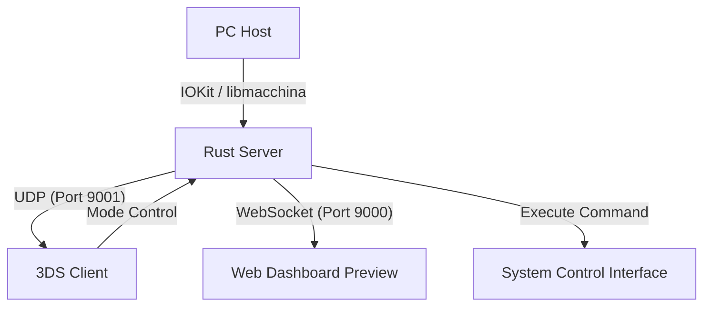

English | [中文](./readMe_ZH.md)

# 3DS Holographic PC Dashboard

[](https://www.rust-lang.org/)
[-blue.svg)](https://devkitpro.org/)
[](#web-preview)

A PC system monitoring dashboard that leverages the Nintendo 3DS's glass-free 3D (stereoscopic) effect.
Your 3DS is no longer just a gaming console, but a high-tech 3D "holographic" monitoring sub-screen.

## 📸 Screenshots

| Top Screen | Bottom Screen |
| :---: | :---: |
|  |  |

## 🌟 Vision

Break free from flat numerical monitoring and project your PC's status into the virtual 3D space of the 3DS.
- **Glass-free 3D Depth**: Utilizing the 3DS parallax barrier technology, indices like CPU usage and temperature have real spatial depth, adjustable via the 3D slider.
- **High-Performance Monitoring**: Hardware monitoring optimized for Apple Silicon (M1/M2/M3), supporting real-time temperature, fan speed, and precise battery status (AC connection detection).
- **Cyber Aesthetic**: Includes dynamic 3D fan models, real-time power consumption waveforms, and a Glassmorphism Web preview interface.

## 🏗️ Architecture



## 📦 Components

### 1. Rust Server (`/server`)
A high-performance data collection and distribution center based on Rust.
- **Hardware Integration**: Uses `libmacchina` for detailed system metadata (hostname, kernel, CPU model, etc.); leverages `temp-sensor` (based on IOKit HID) for high-frequency hardware monitoring on Apple Silicon without root.
- **Multi-Terminal Distribution**:
    - **UDP Broadcast**: For zero-config discovery and sub-second data synchronization with the 3DS client within the LAN.
    - **WebSocket**: Provides real-time JSON data streams for Web frontends, supporting 3D rendering in modern browsers.
- **Smart Power Management**: Accurately distinguishes between "Charging", "Fully Charged (AC Connected)", and "Discharging" states.

### 2. 3DS Client (`/3ds`)
A native Homebrew application developed with `devkitPro` and `citro3d`, deeply optimized for hardware performance.
- **Top Screen**:
    - **Stereoscopic 3D Progress Bars**: CPU/RAM/SWAP status pillars with thickness and shadows, supporting 3D depth adjustment.
    - **3D Powered Fan**: A physical simulation of a 3D fan model based on actual RPM, with smooth clock-synced animations.
- **Bottom Screen**:
    - **Real-time Trend Chart**: Records power fluctuations in Watts.
    - **System Overview**: Displays OS version, hostname, core load/frequency, battery health, and system Uptime.

### 3. Web Dashboard Preview (`/web`)
A 3D visualization preview tool based on Three.js.
- **Real 3D Modeling**: Synchronously simulates the 3D core state on the web, supporting real-time rotation and scaling.
- **Modern UI**: Extreme transparent glassmorphism design, suitable as a desktop sub-screen or remote mobile monitoring.

## 🚀 Quick Start

### Prerequisites
- **Server**: [Rust](https://www.rust-lang.org/) (Cargo)
- **3DS**: [devkitPro](https://devkitpro.org/) (including `libctru`, `citro3d`)
- **Web**: A modern browser with WebGL support

### Build & Run

#### 1. Server

**Option A: Developer Mode (Cargo)**
Suitable for debugging and development.
```bash
cd server
# Compile the temperature tool for the first time
cd temp-sensor && clang -framework IOKit -framework Foundation -o temp_sensor temp_sensor.m && cd ..
cargo run --release
```

**Option B: Production Mode (Build Script)**
Suitable for deployment as an independent module.
```bash
cd server
chmod +x build.sh
./build.sh
# Run the distribution build
./dist/holographic-monitor
```

> [!NOTE]
> The build products are located in the `server/dist` directory, including the main program `holographic-monitor` and the hardware plugin `temp_sensor`. Ensure both files are in the same directory when migrating to other macOS devices.

#### 2. 3DS Client
```bash
cd 3ds
make
# Copy the generated holographic-monitor.3dsx to the SD card's /3ds directory
```

#### 3. Web Preview
Open `web/index.html` directly in your browser.

## 🛠️ Troubleshooting
- **Server Not Found**: Check PC firewall settings to ensure UDP port 9001 allows broadcast packets.
- **Apple Silicon Temperature Reading**: Ensure the `temp_sensor` binary is in the correct relative path to the `server`.
- **3D Depth Issues**: If ghosting occurs, try reducing the 3D slider on the 3DS or check screen calibration.

---
*Created by Antigravity - Powered by Stereoscopic Vision.*