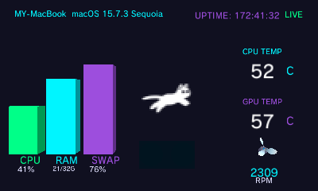
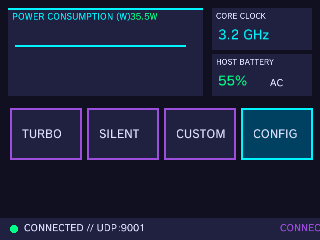
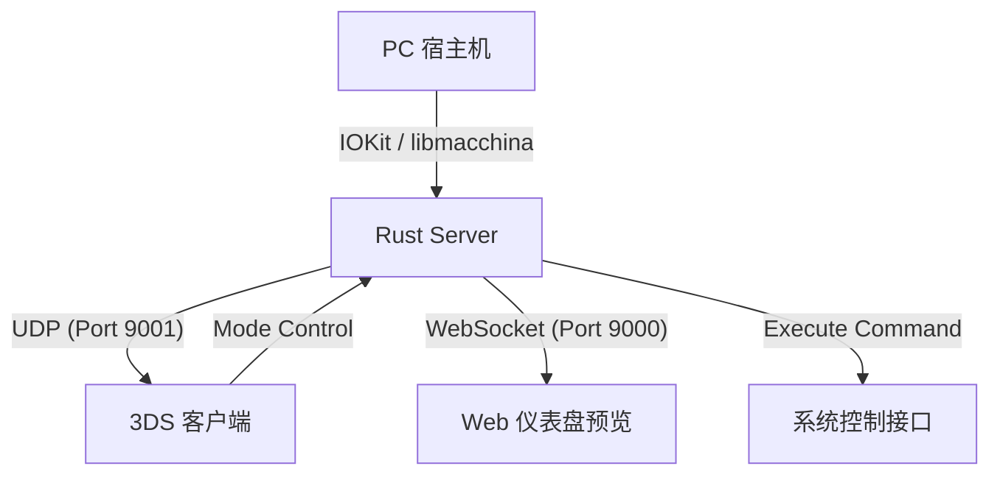

[English](./readMe.md) | 中文

# 3DS Holographic PC Dashboard (3D 赛博仪表盘)

[](https://www.rust-lang.org/)
[-blue.svg)](https://devkitpro.org/)
[](#web-仪表盘)

一个利用 Nintendo 3DS 裸眼 3D 特效实现的 PC 系统监控仪表盘。
你的 3DS 不再只是游戏机，而是一个充满科技感的 3D “全息”监控副屏。

## 📸 运行截图

| 上屏 (Top Screen) | 下屏 (Bottom Screen) |
| :---: | :---: |
|  |  |

## 🌟 核心愿景

摆脱扁平的数字监控，将 PC 运行状态投影到 3DS 的 3D 虚拟空间中。
- **裸眼 3D 深度**：利用 3DS 视差屏障技术，CPU 占用率、温度等数据具有真实空间深度，并随 3D 滑块实时调整景深。
- **高性能监控**：专为 Apple Silicon (M1/M2/M3) 优化的硬件监控，支持实时温度、风扇转速及精准的电池状态（AC 连接识别）。
- **赛博美学**：包含动态旋转的 3D 风扇模型、实时功耗波形图以及玻璃拟态 (Glassmorphism) 的 Web 预览界面。

## 🏗️ 项目架构



## 📦 组件说明

### 1. Rust 服务端 (`/server`)
基于 Rust 的高性能数据采集与中转中心。
- **深入硬件**：通过 `libmacchina` 获取详细的系统元数据（主机名、内核、CPU 型号等）；利用 `temp-sensor` (基于 IOKit HID) 在 Apple Silicon 上实现免 root 的高频硬件监控。
- **多端分发**：
    - **UDP 广播**：用于局域网内 3DS 客户端的零配置发现与亚秒级数据同步。
    - **WebSocket**：为 Web 前端提供实时 JSON 数据流，支持 modern 浏览器的 3D 渲染。
- **电池智能**：能够准确区分“正在充电”、“已充满（AC 连接）”与“放电中”状态。

### 2. 3DS 客户端 (`/3ds`)
使用 `devkitPro` 和 `citro3d` 开发的原生 Homebrew 应用，深度适配硬件性能。
- **上屏 (Top Screen)**：
    - **立体 3D 进度条**：具有厚度和阴影的 CPU/RAM/SWAP 指示柱，支持立体深度调节。
    - **3D 动力风扇**：根据实际转速物理模拟的 3D 风扇模型，带有时钟同步的平滑动画。
- **下屏 (Bottom Screen)**：
    - **实时趋势图**：记录 W 数波动的功率变化曲线。
    - **系统全景**：显示 OS 版本、主机名、核心负载频率、电池健康及系统运行时间 (Uptime)。

### 3. Web 仪表盘预览 (`/web`)
基于 Three.js 的 3D 可视化预览工具。
- **全 3D 建模**：在网页端同步模拟 3D 核心状态，支持实时旋转、缩放。
- **现代 UI**：极致的透明毛玻璃设计，适合作为桌面辅屏或手机端远程监控。

## 🚀 快速开始

### 环境依赖
- **Server**: [Rust](https://www.rust-lang.org/) (Cargo)
- **3DS**: [devkitPro](https://devkitpro.org/) (包含 `libctru`, `citro3d`)
- **Web**: 支持 WebGL 的现代浏览器

### 构建与运行

#### 1. 服务端

**方式 A: 开发者模式 (Cargo)**
适用于调试和开发。
```bash
cd server
# 首次运行请编译温度工具
cd temp-sensor && clang -framework IOKit -framework Foundation -o temp_sensor temp_sensor.m && cd ..
cargo run --release
```

**方式 B: 生产模式 (一键打包)**
适用于部署到其他机器或作为独立模块运行。
```bash
cd server
chmod +x build.sh
./build.sh
# 运行打包产物
./dist/holographic-monitor
```

> [!NOTE]
> 打包产物位于 `server/dist` 目录下，包含主程序 `holographic-monitor` 和硬件插件 `temp_sensor`。在迁移到其他 macOS 设备时，请确保这两个文件处于同一目录下。

#### 2. 3DS 客户端
```bash
cd 3ds
make
# 拷贝生成的 holographic-monitor.3dsx 到 SD 卡 /3ds 目录
```

#### 3. Web 预览
直接在浏览器中打开 `web/index.html`。

## 🛠️ 故障排除
- **无法发现服务器**：检查 PC 防火墙，确保 UDP 9001 端口允许广播包。
- **Apple Silicon 温度读取**：确保 `temp_sensor` 二进制文件与 `server` 处于正确的相对路径。
- **3D 深度问题**：若 3D 效果出现重影，请尝试调小 3DS 侧边滑块，或检查屏幕校准。

---
*Created by Antigravity - Powered by Stereoscopic Vision.*
